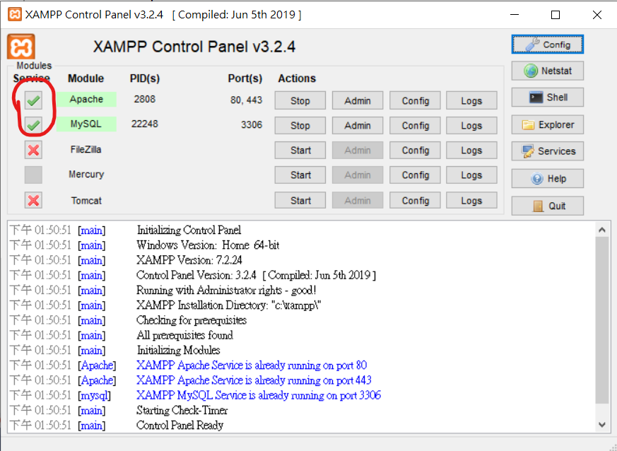

# EasyAMP -- A quick & dirty extended control panel for XAMPP users.
## How does it works?
---
This program currently provides the following funtions:
- start/stop the Apache & MySQL servers.
- Create the apache virtual host settings with only one click.
- Copy Laravel starter project to virtual host web root.
- Navigate to web site on each virtual host.
- Go to the server root directory with windows file manager.

## Configuration
1. First you need to install XAMPP with all default option (this is important).
2. Start XAMPP by running xampp-control.exe in XAMPP directory with admin privilege, and check Apache and MySQL service buttons to install services.

3. Uncheck readonly checkbox in 'C:\Windows\System32\drivers\etc\hosts' file' s file attributes.

